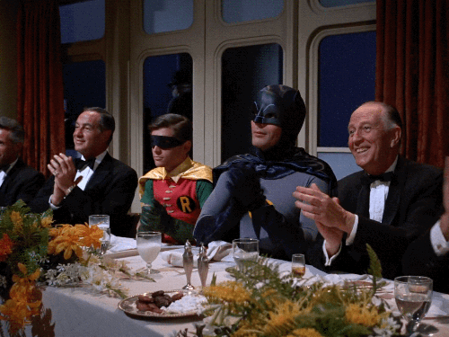

```{r xaringan-themer, include = FALSE}
# install.packages(c("xaringan", "devtools"))
# devtools::install_github("gadenbuie/xaringanthemer")
library(xaringanthemer)
mono_light(
  base_color = "#201E20",
  header_font_google = google_font("Josefin Sans"),
  text_font_google   = google_font("Barlow", "400", "400i"),
  code_font_google   = google_font("Droid Mono"),
)
```

---
background-image: url("img/logo-texto.png")
background-size: 200px
background-position: 100% 0%

# Sigam-nos nas redes sociais

.pull-left[
```{r fig.height=6, eval=require('leaflet'), echo = FALSE}
library(leaflet)
leaflet() %>% addTiles() %>% 
  setView(
  -34.846199, -7.140400, zoom = 17,
  options = popupOptions(
    minWidth = 150,
    maxWidth = 150
  )
)
```
]

--

.fadeInLeft.animated[

.pull-right[
#### Prof. Dr. Pedro Rafael D. Marinho:
[`r icon::fa("paper-plane")` **pedro.rafael.marinho@gmail.com**](mailto:pedro.rafael.marinho@gmail.com)</br>
[`r icon::fa("github")` **Meu GitHub: https://github.com/prdm0**](https://github.com/prdm0)</br> 
[`r icon::fa("instagram")` **@prdm.0**](https://www.instagram.com/prdm.0/)</br>
[`r icon::fa("twitter")` **@Pedro_Rafael1**](https://twitter.com/Pedro_Rafael1)  

#### Redes sociais e outras informações do Departamento de Estatística da UFPB:

[`r icon::fa("link")` **Site do Departamento**: **http://www.de.ufpb.br/**](http://www.de.ufpb.br/)  
[`r icon::fa("instagram")` **@estatisticaufpb**](https://www.instagram.com/estatisticaufpb/)  
[`r icon::fa("twitter")` **@estatisticaufpb**](https://twitter.com/estatisticaufpb)  
[`r icon::fa("github")` **GitHub do DE: https://github.com/de-ufpb**](https://github.com/de-ufpb)  
]]

---
background-position: 100% 0%
class: inverse, center, middle

# Pré-requisitos para o acompanhamento dessa palestra


---
background-image: url("img/logo-texto.png")
background-size: 200px
background-position: 100% 0%

# Pré-requisitos

O espectador deverá ter algum contato no que se refere à programação em linguagem R. Alguns aspectos importantes são:

--

- Principais estruturas de dados em **R**;

- Instruções de condição: `if`, `else` e `switch`;

- Emprego dos operadores `break` e `next`;

- Instruções de repetição: `for`, `while` e `repeat`.

--

## Pré-requisitos de ferramentas computacionais:

Ter a linguagem de programação **R** instalada; </br>

Instalar o pacote [**purrr**](https://purrr.tidyverse.org/) instalado e carregado:

.fadeInDownBig.animated[
```{r eval=FALSE, tidy=FALSE}
install.packages("purrr")
library(purrr)
```
]


---
background-image: url("img/logo-texto.png")
background-size: 200px
background-position: 100% 0%

# Caso julge não ter os pré-requisitos


--
.pull-left[
- Livro de Estatística Computacional do Prof. Pedro Rafael: </br>
[* **https://prdm0.github.io/aulas_computacional/** *](https://prdm0.github.io/aulas_computacional/); </br>


- Meus slides da disciplina de Programação em linguagem R: </br>
[* **https://prdm0.github.io/aulas_computacional/aulas_r.pdf** *](https://prdm0.github.io/aulas_computacional/aulas_r.pdf);</br>


- Livro Advanced R, Ed. 2, escrito por Hadley Wickham:
</br> [* **https://adv-r.hadley.nz/** *](https://adv-r.hadley.nz/) ; </br>


- Livro básico em língua portuguesa de programação em R escrito por Luiz Torgo: </br>
[* **https://cran.r-project.org/doc/contrib/Torgo-ProgrammingIntro.pdf** *](https://cran.r-project.org/doc/contrib/Torgo-ProgrammingIntro.pdf);</br>

- Manuais da Linguagem R: </br>
[* **https://cran.r-project.org/manuals.html** *](https://cran.r-project.org/manuals.html).
]

.fadeInDownBig.animated[
.pull-right[
```{r, echo=FALSE,out.width="350px",  out.height="350px",fig.cap="",fig.show='hold',fig.align='center'}

```
]]

---
background-position: 100% 0%
class: inverse, center, middle
  
# Programação Funcional


```{r, echo=FALSE,out.width="250px",  out.height="200px",fig.cap="",fig.show='hold',fig.align='center'}

```

---
background-image: url("img/logo-texto.png")
background-size: 200px
background-position: 100% 0%

</br></br>

.pull-left[

<blockquote>
"*Para se tornar significativamente mais confiável, o código deve se tornar mais transparente. Em particular, condições e loops aninhados devem ser vistos com grande suspeita. Fluxos de controle complicados confundem os programadores. Código confuso geralmente oculta bugs.*"
</blockquote>
.right[-- <cite>**Bjarne Stroustrup**</cite>]

</br></br></br></br>
.font50[**Nota**: C++ **não** é uma linguagem de programação de paradigma funcional. C++ é uma linguagem multiparadigma mas que sobre todos os possíveis paradigmas prevalece a Orientação à Objeto - OO. Porém, a frase de seu criador se encaixa como filosofia para uso de funcionais. 
]]

--

.fadeInLeft.animated[
.pull-right[
</br>
```{r, echo=FALSE,out.width="430cm", out.height="300px",fig.cap="Bjarne Stroustrup, criador da Linguagem de Programação C++.",fig.show='hold',fig.align='center'}

```
]]


---
background-position: 100% 0%
class: inverse, center, middle

# R é uma linguagem de programação multiparadigma

---
background-image: url("img/logo-texto.png")
background-size: 200px
background-position: 100% 0%

--

.fadeInLeft.animated[

```{r, echo=FALSE,out.width="470cm", out.height="600px",fig.cap="Chambers, John M. Object-oriented programming, functional programming and R. Statistical Science. (2014). 167-180.",fig.show='hold',fig.align='center'}

```
]

---
background-image: url("img/logo-texto.png")
background-size: 200px
background-position: 100% 0%

# O que linguagens funcionais permite e que R também permite?

--

- Funções podem ser enxergada uma estrutura de dados qualquer;

--


- Podemos passar funções para variáveis;

--


- Podemos passar funções para listas;

--

- Podemos definir funções dentro de funções;

--

- Podemos passar funções como argumentos de outras funções e obter  como retorno um vetor, isto é, poderemos utilizar/escrever **funcionais**;

--

- Podemos devolver funções como resultados de funções, a exemplo dos **closures**.

</br>

--

.fadeInDownBig.animated[
A rigor, **R** não é uma linguagem funcional pois linguagens funcionais exigem que venhamos escrever funções puras, isto é, funções que sempre devolvem o mesmo resultados. No entanto, adotar o estilo de programação funcional poderá oferecer diversas vantangens. Dividir o problema entre funções puras e funções impuras tende levar a criação de códigos mais fáceis de entender.
]

---
background-image: url("img/logo-texto.png")
background-size: 200px
background-position: 100% 0%

</br>

.pull-left[

<blockquote>
"*É difícil descrever exatamente o que é um estilo funcional, mas geralmente acho que isso significa decompor um grande problema em pedaços menores e depois resolver cada peça com uma função ou combinação de funções. Ao usar um estilo funcional, você se esforça para decompor os componentes do problema em funções isoladas que operam independentemente. Cada função assumida por si só é simples e direta de entender; a complexidade é tratada compondo funções de várias maneiras.*"
</blockquote>
.right[-- <cite>**Hadley Wickham**</cite>]

]

--

</br></br></br></br>
.fadeInLeft.animated[
.pull-right[
```{r, echo=FALSE,out.width="380cm", out.height="400px",fig.cap="Hadley Wickham.",fig.show='hold',fig.align='center'}

```
]]


---
background-position: 100% 0%
class: inverse, center, middle

# O que eu ganho em considerar aprender a utilizar funcionais?

---
background-image: url("img/logo-texto.png")
background-size: 200px
background-position: 100% 0%

# Vantagens dos funcionais 

</br>

.pull-left[
- O código ficará mais **limpo** e **elegante**; </br></br>


- O código ficará mais fácil de **manter** e **debugar**; </br></br>


- Utilizando os funcionais disponíveis pelo **r-base** ou por pacotes como o **purrr**, **furrr**  ou qualquer outro pacote que implemente funcionais de forma eficientes, você poderá tornar o seu código computacionalmente mais **eficaz**; </br></br>


- É fácil **paralelizar** códigos usando funcionais. Tudo poderá ser feito sem grandes modificações do código original. Isso é uma grande vantagem. 
]
--
.fadeInDownBig.animated[
.pull-right[
```{r, echo=FALSE,out.width="300px",  out.height="300px",fig.cap="Você gostou dos benefícios do uso de funcionais?",fig.show='hold',fig.align='center'}

```
]]

---
background-image: url("img/logo-texto.png")
background-size: 200px
background-position: 100% 0%

</br>

```{r, echo=FALSE,out.width="380cm", out.height="400px",fig.cap="Hex do pacote purrr.",fig.show='hold',fig.align='center'}
knitr::include_graphics("img/purrr_hex.png")
```

O pacote **purrr** ([**https://github.com/tidyverse/purrr**](https://github.com/tidyverse/purrr)), entrega para quem trabalha com estatística, diversos funcionais que são de grande utilidade na implementação de códigos. Esses funcionais somado com os funcionais do **r-base** são ferramentas essenciais para quem deseja produzir códigos eficientes em **R**.

---
background-position: 100% 0%
class: inverse, center, middle

# Solucionando um problema com o uso de funcionais


---
background-image: url("img/logo-texto.png")
background-size: 200px
background-position: 100% 0%

# Uso de funcionais em um problema hipotético 
</br>


.fadeInDownBig.animated[
Seja $G$ uma distribuição de probabilidade qualquer com vetor de parâmetros $\xi$ e $F$ uma função de distribuição tal que, dado o conhecimento de $G$, temos que:

$$F(x; \theta) = G^a(x),$$

</br> 

com $\theta = (\xi, a)$, tal que $a > 0$ e $x>0$. Diremos que uma v.a. tal que $X \sim F$ segue distribuição **Exp-G**.

</br>

Dado $G$, realize uma simulação de **Monte-Carlo - MC** para estudar o viés dos **estimadores numéricos de máxima verossimilhança** obtidos pelo método **BFGS** para os parâmetros que indexam a distribuição $F$. Nas iterações de MC, considere obter os cenários provenientes da distribuição $G$. 
]

---
background-image: url("img/logo-texto.png")
background-size: 200px
background-position: 100% 0%

# O que será feito?
  
</br>

--
.fadeInDownBig.animated[
- Uso do conceito de **funções anônimas** e **closures** para a escrita generalizada de $F$; </br></br>

- Uso de **funcionais** para iterar o procedimento de MC; </br></br>

- **Paralelização** do código; </br></br>

- Introdução de uma **barra de progresso** mensurando o tempo de término da simulação de MC; </br></br>

- Outros detalhes serão apresentados no código.
]


---
background-image: url("img/logo-texto.png")
background-size: 200px
background-position: 100% 0%

--

</br></br>

```{r, echo=FALSE,out.width="600cm", out.height="500px",fig.cap="Fim.",fig.show='hold',fig.align='center'}

```

